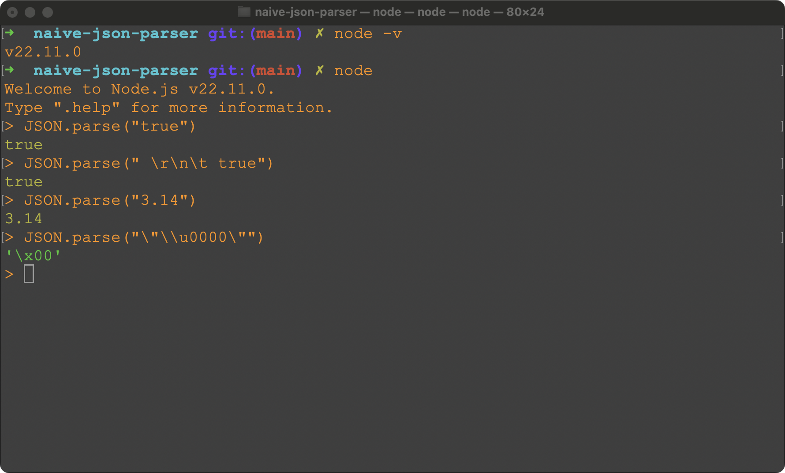
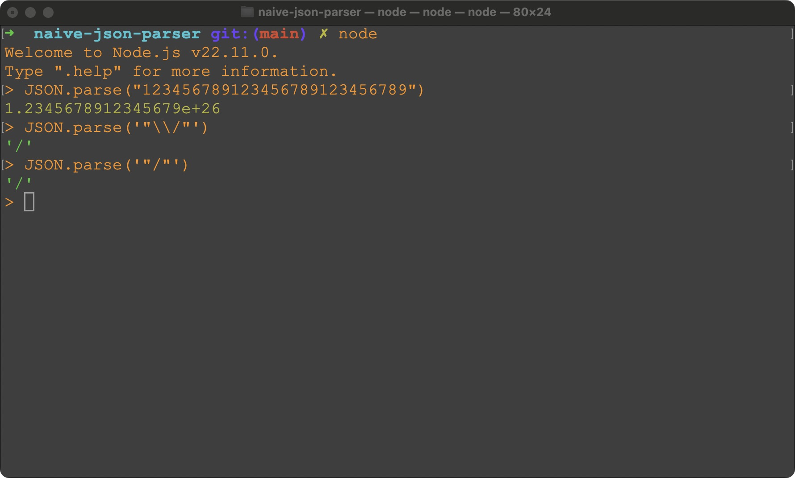

# naive-json-parser

A naive parser for `JSON` string

## Some questions

Before diving into this project, let's think over the following questions

1. Is `"true"` a valid `JSON` string? What about `" \r\n\t true"`, `"3.14"`, `"\"\u0000\""`? (and more)
2. With `node.js`, `JSON.parse("123456789123456789123456789")` returns `1.2345678912345679e+26`, so does `JSON` format
   support arbitrary length integers?
3. With `node.js`, both `JSON.parse('"\\/"')` and `JSON.parse('"/"')` run successfully, does `JSON` format support both
   `"\\/"` and `"/"`?

For question 1, all of `"true"`, `" \r\n\t true"`, `"3.14"`, `"\"\u0000\""` are parsed successfully by `JSON.parse(...)`


For question 2 and 3, what I tried can be seen as follows


To get a good understanding of `JSON` format, I referred to [Introducing JSON](https://www.json.org/json-en.html)
and implemented a simple `JSON` parser in this project.
It should be able to handle arbitrary length `JSON` string (the max length of `java` string is **2147483647**, please
don't let the input string exceed this length limit).
If you find any bug, welcome to create an `issue`, thanks.

## Usage

Step 1: Build a `jar` file with the following command

```bash
mvn clean package
```

Step 2: Use this `jar` file to parse and pretty print `JSON` string from standard input or specified input file.
Two examples are shown below.

### Example 1: with standard input

```bash
echo '  [   {"Message": "Hello, world", "Some special numbers": [4.2E1, 23E0,   3.14159265358979], "Today is Saturday" : true, "Needs to work": false, "Test for null": null}]' | \
  java -jar target/naive-json-parser-1.0-SNAPSHOT-jar-with-dependencies.jar
```

The output is like this

```json
[
  {
    "Message": "Hello, world",
    "Some special numbers": [
      4.2E1,
      23E0,
      3.14159265358979
    ],
    "Today is Saturday": true,
    "Needs to work": false,
    "Test for null": null
  }
]
```

# Example 2: with specified input file

```bash
echo '[ "Hello", 3.14, true, {"key1": ["value1", "value2"]} ]' > input.json
java -jar target/naive-json-parser-1.0-SNAPSHOT-jar-with-dependencies.jar -f input.json
```

The output is like this

```json
[
  "Hello",
  3.14,
  true,
  {
    "key1": [
      "value1",
      "value2"
    ]
  }
]
```

## Code structure

Let's take a look at the `main` method in `com.study.Main` class

```java
public static void main(String[] args) throws IOException {
    SimpleOptionHandler optionHandler = new SimpleOptionHandler(args);

    try (InputStream inputStream = optionHandler.isFileSpecified() ? new FileInputStream(optionHandler.getFileName()) : System.in) {
        byte[] bytes = inputStream.readAllBytes();
        String raw = new String(bytes, StandardCharsets.UTF_8);

        JsonParser jsonParser = new JsonParser();
        Json json = jsonParser.parse(new PeekingIterator<>(raw.codePoints().iterator()));

        PresenterFacade presenterFacade = new PresenterFacade();
        String result = presenterFacade.convertToString(json);
        System.out.println(result);
    }
}
```

There are 4 steps.

1. Command line arguments handling (`-f/--file` option is supported)
2. Read from `stdin` or the specified file
3. Parse as a `Json` instance
4. Present this `Json` instance

A `JSON` value can be any of the below items

* _object_
* _array_
* _string_
* _number_
* _"true"_ (i.e. literal `true`)
* _"false"_ (i.e. literal `false`)
* _"null"_ (i.e. literal `null`)

The key idea for parsing the above seven items can be classified into five cases.
Let me show these five cases from easier ones to complex ones.

### 1. For `null/false/true` case

For `null`, `false`, `true`, they are special literal items.
They are parsed by the below parsers respectively

1. [CaseNullParser](src/main/java/com/study/parser/CaseNullParser.java)
2. [CaseFalseParser](src/main/java/com/study/parser/CaseFalseParser.java)
3. [CaseTrueParser](src/main/java/com/study/parser/CaseTrueParser.java)

### 2. For `number` case

A `number` has below three parts

1. `integer`
2. `fraction`
3. `exponent`

`Number` items are parsed by [NumberParser](src/main/java/com/study/parser/number/NumberParser.java).
As there are three parts (`fraction` and `exponent` can be empty) within a `number` item,
[IntegerParser](src/main/java/com/study/parser/number/IntegerParser.java),
[FractionParser](src/main/java/com/study/parser/number/FractionParser.java),
[ExponentParser](src/main/java/com/study/parser/number/ExponentParser.java) are used to parse these three parts
respectively.

### 3. For `string` case

A `string` is composed by below three parts.

1. A leading `"`
2. `characters`
3. A tailing `"`

`String` items are parsed by [StringParser](src/main/java/com/study/parser/string/StringParser.java).
A [StringParser](src/main/java/com/study/parser/string/StringParser.java) implements the logic for matching
leading/tailing `"` by itself,
while it dispatches the logic of matching `characters` to
a [CharactersParser](src/main/java/com/study/parser/string/CharactersParser.java).

### 4. For `array` case

An `array` item comes in one of below two formats

* `'[' ws ']'` (case one)
* `'[' elements ']'` (case two)

`Array` items are parsed by [ArrayParser](src/main/java/com/study/parser/ArrayParser.java).
To handle **case one**, [WhitespaceParser](src/main/java/com/study/parser/WhitespaceParser.java) is used.
To handle **case two**, [ElementsParser](src/main/java/com/study/parser/ElementsParser.java) is used.

### 5. For `object` case

An `object` item comes in one of below two formats

* `'{' ws '}'` (case one)
* `'{' members '}'` (case two)

`Object` items are parsed by [ObjectParser](src/main/java/com/study/parser/ObjectParser.java).
To handle **case one**, [WhitespaceParser](src/main/java/com/study/parser/WhitespaceParser.java) is used.
To handle **case two**, [MembersParser](src/main/java/com/study/parser/MembersParser.java) is used.

## TODO
* Use some library for command line arguments handling (e.g. arguments for output-file, indent-level-control)
* Use slf4j for logging